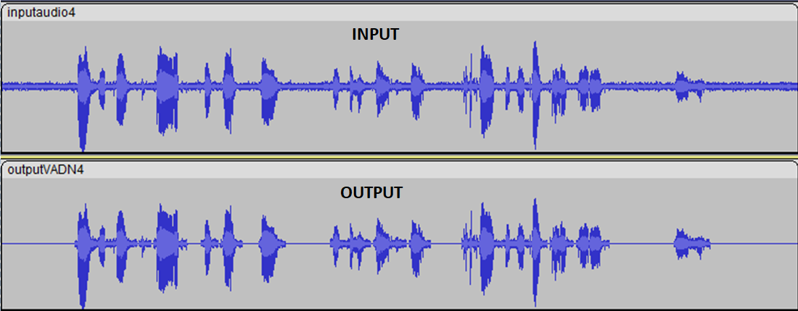

# Voice Activity Detector
<p align="center">
    
</p>

## Specifications
Considered a mono digital audio signal, in PCM format, which is assumed to be generated in real time, a Voice Detection Algorithm (VAD) has to be designed.
The trasmitter sends the signal, after packetizing it considering 160 audio samples for each packet (corresponding to an audio interval of 20ms).

For each packet, the algorithm has to determine whether the packet has to be trasmitted or not. The decision made by the VAD algorithm can be taken considering any subset of the packets sent in the past and even subsequent ones, provided the overall delay remains below 50ms (hence up to 2 packets in the future can be considered).
The goal is to transmit the lowest possible number of packets that allows the reconstruction of the voice signal without clipping.

## Overview
The script is aimed to remove the background noise in an audio transmission in order to reduce the amount of data to send.
Given an input file inputaudioN.data (see the inputdatabase folder), the goal of the algorithm is to suppress all the silences and produce 2 output files:
1) outputVADN.data: the output of the VAD algorithm with the bits to send over the communication channel.
2) outputVADN.txt: file containing either 1/0 for each packet: 1 if the packet was sent, 0 if the packet is silent.

As sending only the packets containing voice would produce an output "unnatural" to the listener, e.g. A word starting abruptly after utter silence may sound strange to the other person taking part in the conversation, I decided to send 3 packets (~60ms) before the beginning and one (20ms) after the end of words.

Firstly, the FFT of each packet was evaluated in order to transform the samples into the frequency domain. Then, we can understand whether the packet contains voice or not if the highest frequency is inside the range for human voices ([200,3400]Hz).

Audacity is the software used to check the results:




## Compilation and Usage

To compile the program from the main folder of the project:
```
g++ -o main \*.cpp
```

To run the algorithm on a specific file:
* Run **main** from the terminal
* Follow the instructions you will see on the screen
